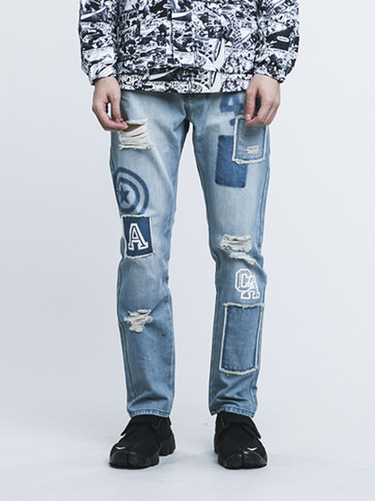
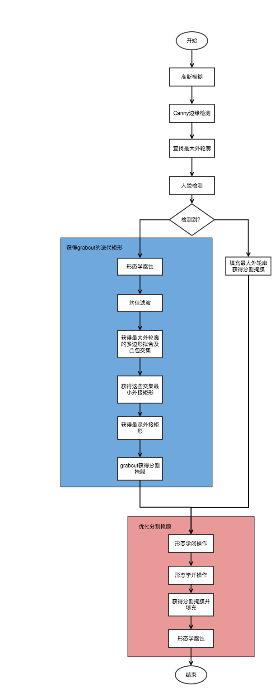
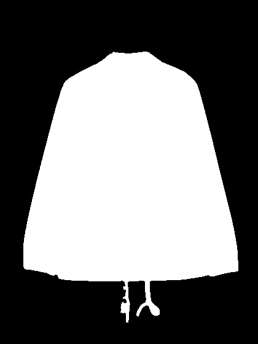
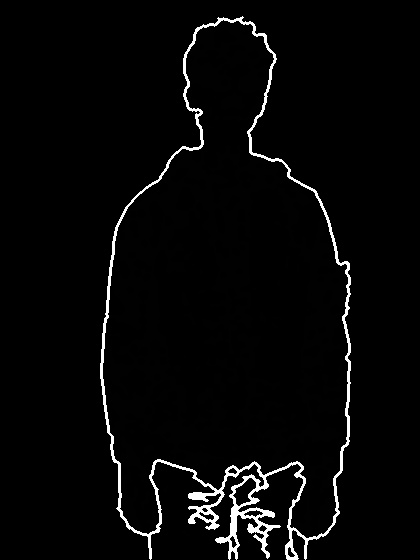
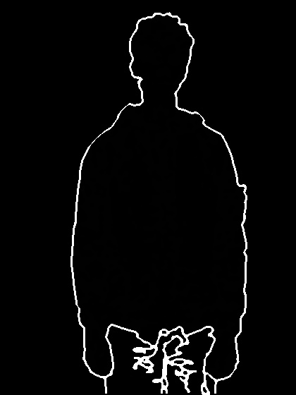
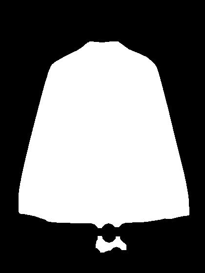
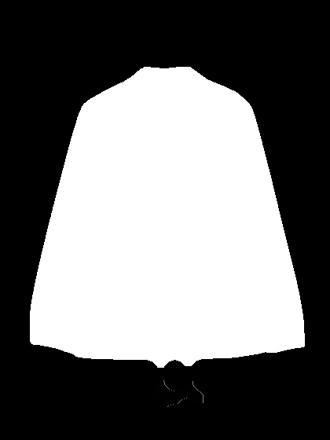
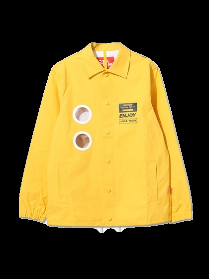

衣物分割
========

分割是服饰搭配推荐系统的第一环，也是极为重要的一环，因为服饰搭配系统中机器学习部分需要的特征全部来源于衣物（这里的衣物包含上装和下装）。

基于策略的分割
--------------

本次采集的数据来源于[yoho](http://www.yohobuy.com/)的[逛](http://guang.yohobuy.com/?channel=boys)板块, 总共爬取约1000余副图像，但遗憾的是，图片的质量层次不齐，很难设计一个普适的方法对所有图像进行一致分割。因而当图像读入后，系统将不急于立即进行分割，而是通过一定的手段先确定当前衣物的情境，进而根据不同的情境进行不同策略的分割。

> 每种情境下，可能还有子情境

上装情境
--------

### 纯净情境（Pure Situation）

该情境图像质量较高，衣物为摄影主题，背景单纯：

### 模特情境（Model Situation）

该情境除衣物外，还含有模特，以及黏着有一部分下装，在分割的时候需要考虑去除**人脸**，**手臂**，**黏着的下装**：

下装情境
--------

### 纯净情境（Pure Situation）

该情境图像质量较高，衣物为摄影主题，背景单纯：

### 模特情境（Model Situation）

该情境除衣物外，还含有模特，以及黏着有一部分上装，鞋子。在分割的时候需要考虑去除**黏着上装**，**鞋子**：

流程概述
--------

### 上装分割流程

**Step 1：图像预处理**:

图像预处理阶段，将会使用高斯模糊降噪，窗口的大小为3x3。

**Step 2：边缘提取**:

第二阶段是边缘提取，将会使用Canny边缘检测，其中高低阈值分别为100，200。并且，会在之后通过形态学闭操作修复断线

**Step 3：分割**:

*Step 3.1: 情境判断*：

第三阶段开始进入分割，正如上文提到的，在分割之前会先进行情境判断，因而会先进行人脸检测，借此判断是否出现模特。

*Step 3.2：获得最大外轮廓*：

无论是何种情境，图像内部的最大外轮廓都是需要的。

*Step 3.3： 获得分割掩膜*

**纯净情境（Pure Situation）**：

纯净情境下，由于图像主题只有衣物，且背景单纯，我们只需要从提取到的边缘中获得最大外轮廓，该轮廓即为衣物轮廓，对其进行填充高亮即可获得分割掩膜，如下所示：

通过该掩膜操纵原图像形成的分割图像如下：

**模特情境（Model Situation）**

模特情境下，图像就较为复杂，最终的分割手段将会采取[grabcut](https://en.wikipedia.org/wiki/GrabCut)，因而就需要设定grabcut需要的矩形框，人工的标定效率实在不高，故而考虑采取自动化的手段为我们确定最终的迭代矩形框。

*Step 3.3.1: 形态学腐蚀操作*：

对含有最大外轮廓的图像进行形态学腐蚀操作的作用在于去除一些衣物上的粘连：

形态学腐蚀操作前：

形态学腐蚀操作后：

*Step 3.3.2: 均值滤波*：

经过形态学腐蚀操作后，会产生一些盐噪声，此时我们可以通过均值滤波进行抹除，结果如下：

*Step 3.3.3: 确定grabcut需要的矩形框*：

现在，外轮廓的外接矩形如下图所示，如果仅以此矩形开始grabcut，那么精确度是不高的：

接下来，会分别获得最大外轮廓的**凸包**以及**拟合多边形**，进一步获得二者交集产生的区域，得到这些区域的外接矩形，如下图所示：

当中最深的矩形为我们需要的。

那么，最终框定的矩形，将是原始外接矩形抹除了上半部分人脸高度，下半部分最深矩形（黏着下装）高度的形成的矩形，如下图所示

进行迭代次数为5的grabcut后，形成的分割掩膜将会如下图所示：

**Step 4: 掩膜优化**

在初步获得的分割掩膜中，可能看到如下现象：

1.	衣物中的一些与背景颜色相近的部分被误认为了背景，形成了黑色（背景）的洞或者沟壑
2.	衣物中黏着的吊饰被保留了下来

问题1，2可以分别用形态学闭操作和形态学开操作解决：

形态学操作前：

形态学操作后：

再排除掉断开部分：

直接使用该掩膜操作原图像，得到的分割图像会黏着有一定的背景边缘:

因此，考虑对掩膜进行一定的腐蚀，最终形成的分割图像如下图所示：

上衣图像分割的待讨论情境
------------------------

-	[] 背景复杂情境
-	[] 模特具有非正面姿态的分割

### 下装分割流程

> 未完待续
